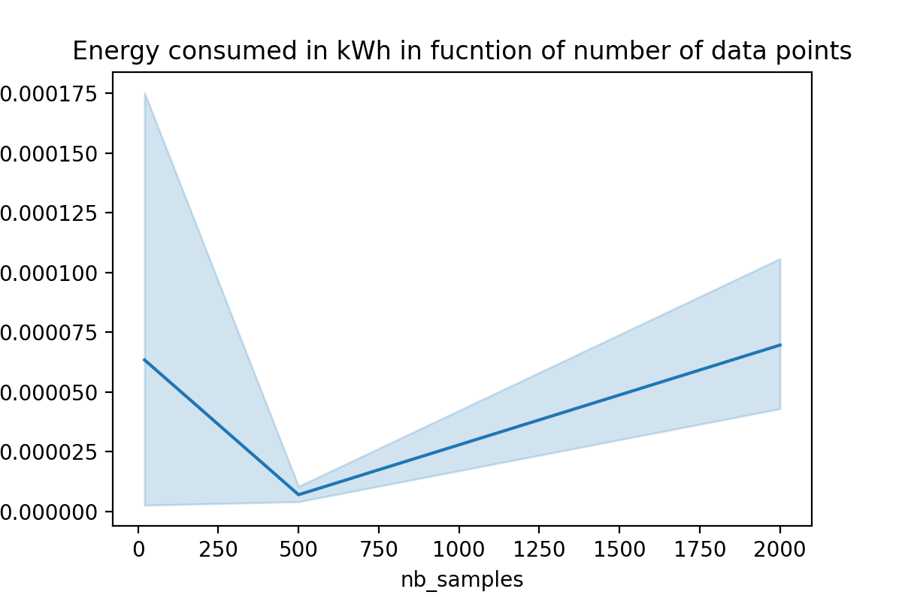
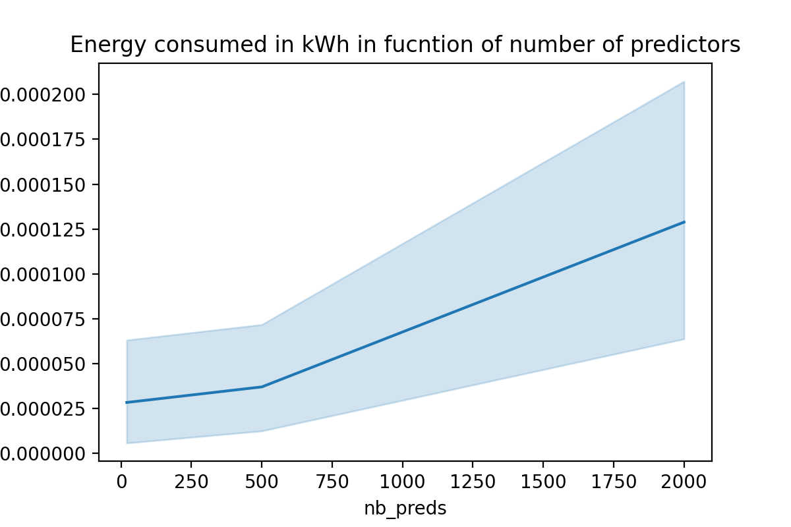
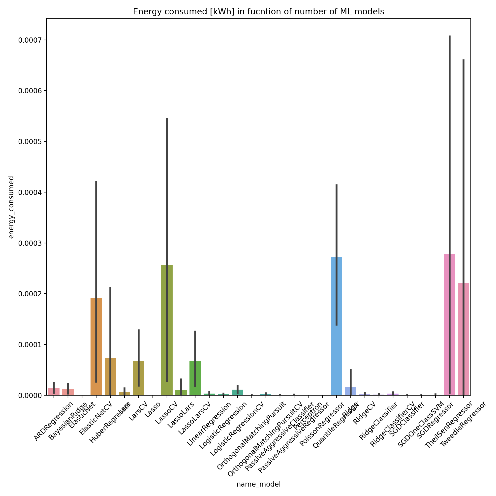

# SnakeChamers
### *LauzHack 2022*
Machine Learning algorithms tend to be very energy-consuming when training them as they require long training hours using a high CPU and even GPU consumption. Given the current energy crisis which will probably be exacerbated in the future, reducing energy will not only be beneficial for the companies but could considerably reduce their carbon footprint. As this results in increased power consumption and cost, it would be good to provide the tools to estimate the energy necessary for training. 

## Environment requirements

The packages necessary for the environment setup are specified in *requirements/* where you can chose the file for either macOS or Windows. The main packages are **codecarbon** which uses information from the Intel processor to estimate the energy consumption during python code execution. 

## Repository organisation
The directory *data* contains all the CSV files obtained during our pipeline training. The python files *hardware_features extractor.py* and *energy_extractor_intel.py* are utilitary files that are need for running our main pathon script *dataset_generator*. The latter script files contains a function called `dataset_generator` which saves and returns a DataFrame.

## Supplementary info
To test a model. e.g. LinearRegression
```python
from sklean.linear_model import LinearRegression
```

## Results

Below we have uploaded visualizations of our dataset generated using the *dataset_generator.py* pipeline. We can see that the energy consumption increases linearly with the number of predictors and datasize-

<p align="center">


</p>

We have also plotted the predictions of a LinearRegressor fitted on our dataset.

We can see that our models .... predicts the energy consumption.
<p align="center">

</p>

